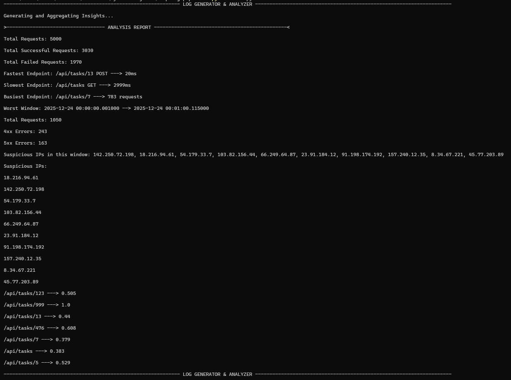

# `HTTP Log Pipeline`

## What is this project ?
- This project demonstrates a HTTP log pipeline including generation and analysis (Producer-Consumer) of logs with separate services.

## Features
- `Seperation of Concerns`
    - Generator and Analyzer services solves different problems with no knowledge of each other internals.
- `Structured Log Generation`   

    ```json
    {
        "method": "GET", 
        "endpoint": "/api/tasks/999", 
        "status_code": "404", 
        "ip": "142.250.72.198", 
        "response_time": 34, 
        "user_agent": "Safari", 
        "timestamp": "2025-12-24T00:00:00.001000"
    }
    ```
- `Log Streaming`             
    - Logs are streamed one by one not stored in memory.
- `Scale-Safe Aggregation`                  
    - Since Logs are not stored in memory, it can handle very large files without failing.
- `Meaningful Metrics`                    
    - Analyzer aggregates meaningful metrics while streaming logs.

### `CLI`


## What problem it solves ?
- It analyzes structured HTTP request logs and aggregates operational metrics to understand traffic patterns, failures, and performance bottlenecks.

## What metrics it provides ?
    1. Total Requests
    2. Total Successful Requests
    3. Total Failed Requests
    4. Fastest Endpoint
    5. Slowest Endpoint
    6. Busiest Endpoint
    7. Worst Window [start - end, total_reqs, 4xx errors, 5xx errors, suspicious_ips]
    8. Overall Suspicious IPs 
    9. Error rates for each endpoint.

## Design Constraints
- No database or external libraries.
- Logs are processed in a single streaming pass.
- Analyzer does not assume log file size fits in memory.
- Generator and analyzer are decoupled by schema, not implementation.


## Folder Structure
    |- main.py          Entry point of the application.
    |- services/
    |   - generator.py  Generates structured logs 
        - analyzer.py   Aggregates insights by streaming logs
    |- utils.py         Utility functions

## How to run it ?

### `Requirements`
- Python version >= 3.12.0

### Clone the repo: 

1.
    ```
    git clone https://github.com/ayvkma/http-log-pipeline.git   
    ```
2.  ```python
    python main.py
    ```

## Key Learnings
- Designing a producer–consumer pipeline.
- Enforcing separation of concerns across services.
- Streaming large NDJSON datasets safely.
- Time-based aggregation and windowing.
- Translating raw logs into operational metrics.

---
This project focuses on correctness and clarity over completeness and intentionally avoids overengineering.

